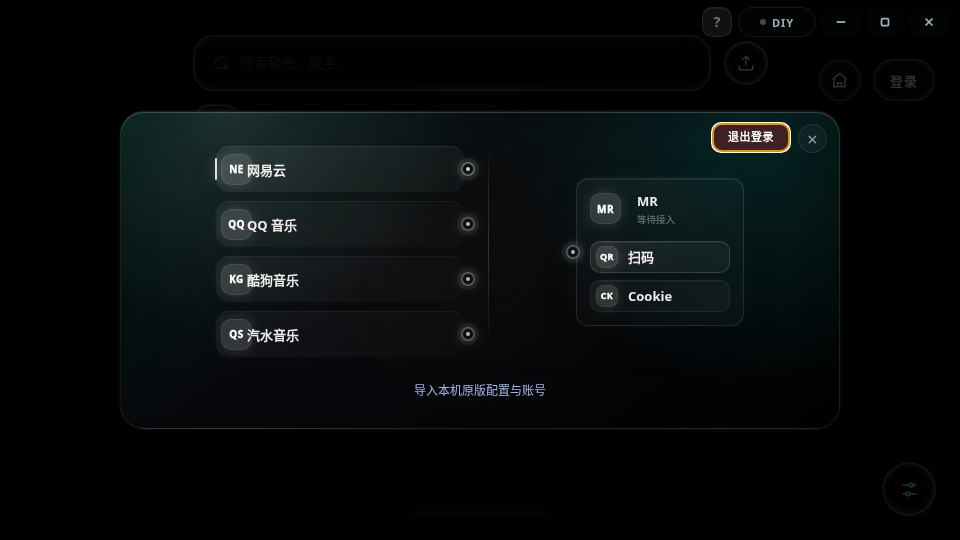
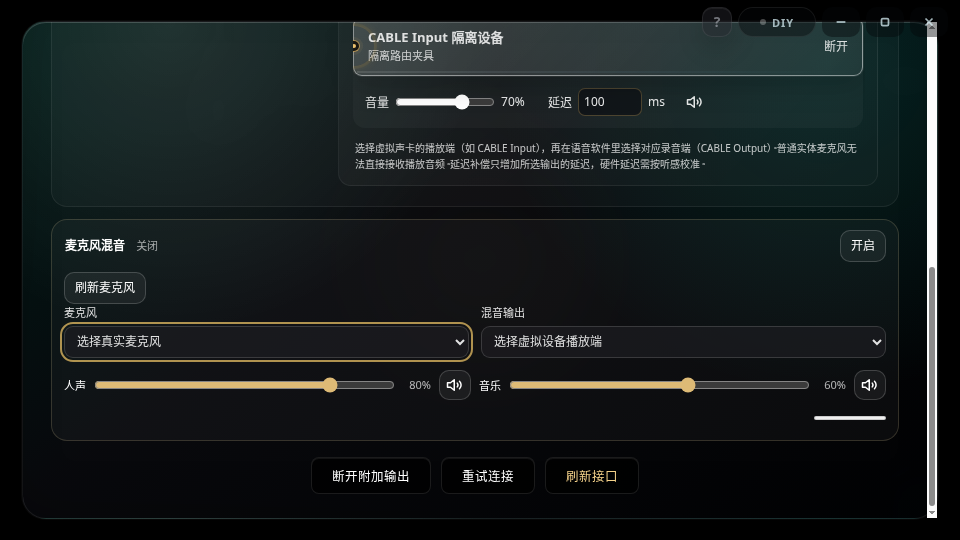
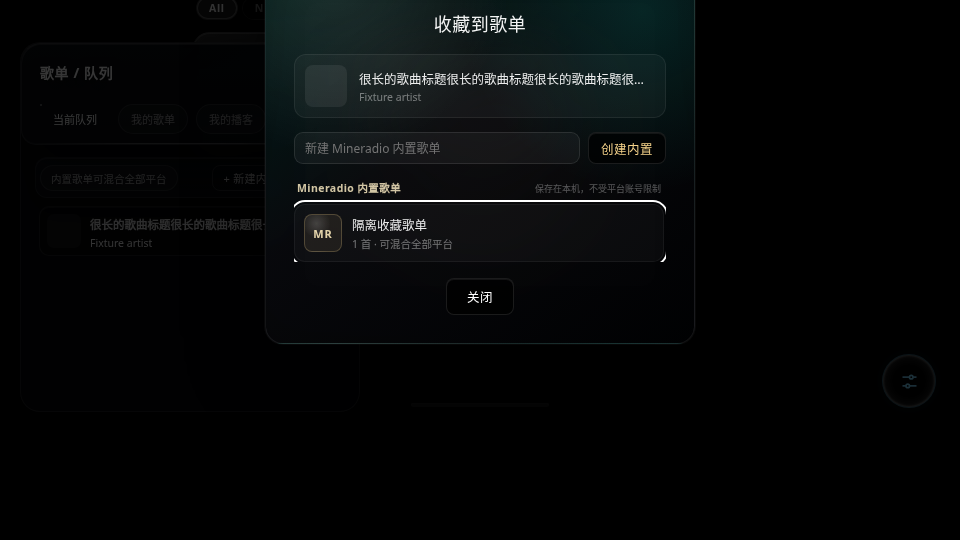
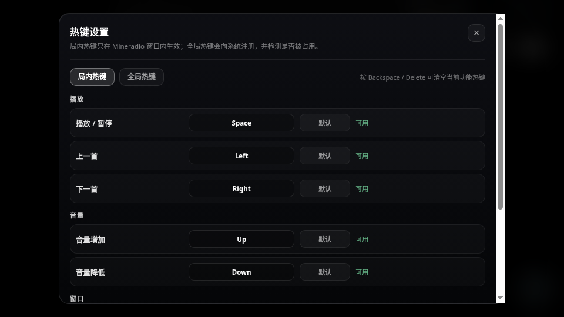

# 前端操作、UI/UX 与可访问性审查 · 2026-10-09

## 结论

本项完成自有前端入口清点、相关生产调用链源读、必要的受控回归与两套真实 Chromium 局部交互夹具。已修复：全局快捷键抢占控件、模态焦点/Escape、视觉控制台开关/标签、歌曲标题和收藏项缺少键盘动作、歌单收藏迟到结果关闭新详情、音频路由刷新丢失麦克风选择框焦点、自动隐藏不尊重键盘操作、首页 MP4 深后台判断/陈旧编辑提交，以及首页图片和棚架封面退场资源问题。没有改变原布局、画质、曲目操作含义或鼠标长按策略；冻结前也补齐了动态热键设置的模态焦点生命周期。

**这不是完整播放器 UI 验收通过报告。** 完整主应用启动被环境 Unix socket `EPERM` 阻断，已确认普通/升级启动均受限，未绕过 singleInstance 或启动锁。独立 Electron 夹具只加载生产 HTML/CSS、选定生产函数和假数据/无副作用动作；没有 `desktop/main.js`、后端、真实账号、曲库、音频流或 3D 场景。没有操作真实麦克风/声卡/摄像头权限，没有发布/推送。

- 基线冻结为 `451b6cf`；标题几何对比用 `git show 451b6cf:<文件>`。资源子审的原始 VM 对比另以其报告所记 `5bc4f03` HEAD 为基线，不混称同一证据。
- 已读项目约定及本地 isolated-ui-check，使用源码与状态断言定位；截图只确认被测面板实际可见，不据截图猜测审美问题。
- 完整控件/事件清单：`QA_INVENTORY_2026-10-09.json` 的 `html_controls`、`inline_html_events`、`html_dialog_panel_candidates`、`event_bindings`。控件数量不是用户路径通过数。
- QA文档、JSON、log与截图是审查产物；生产打包files只纳入特定docs，不能把本清单大小算成播放器运行内存或安装包额外负担。
- 本项逐文件与 F01–F61 限定覆盖：`QA_UI_COVERAGE_2026-10-09.json`；下方列出相同 ledger。函数入口扫描和相关段源读分别注明，不声称每行代码语义或全站读屏穷尽验证。
- 局部回归最终为 **204/204**，日志 `qa/ui-final-regressions.tap`；静态 `npm run check` 通过，完整 Electron 步骤按该命令设计跳过，日志 `qa/ui-final-check.log`。stage新增 paused-lyric-edit-commit 的已证明before为 **1/3**；其修复后本项重跑 **3/3**，`qa/ui-paused-lyrics-initial.tap` 与 after 日志均保留，最终204项包含该测试。

## 已证明并修复的发现

### U1 · P2 · 全局快捷键抢占按钮和已消费事件

- 位置：`05-playback/01-cover-custom-map.js:9`、`04-shelf/06-keyboard-camera-events.js`、`10-shell/01-viewport-resize-shortcuts.js`。
- 根因：只排除输入框，未尊重 `defaultPrevented`；自由相机 capture 更早消费 Space/R，普通按钮 Space 被播放器 `preventDefault`，Arrow/PageDown 可同时触发切歌/棚架翻页。
- 复现：生产事件模块 VM 将按钮作为 Space/KeyR/PageDown target，或先消费 ArrowRight；旧实现仍改变播放器/镜头状态。
- 影响：键盘无法执行所聚焦动作，音乐/镜头可意外变化。
- 修复：共享 UI target 判定（原生/ARIA 操作元素及 dialog），capture/bubble 尊重已消费事件。body 原 Space/左右键仍可用。
- 证据：`tests/ui-keyboard-interaction.test.js`；`qa/ui-keyboard-before.tap` 5 fail/1 pass，after 6 pass；真实 Chromium 登录按钮 Space 仅产生 `loginButton`，没有 togglePlay。

### U2 · P2 · modal-mask 缺少统一焦点生命周期和 Escape 路由

- 位置：`08-account/01-login-modal-utils.js:1–160`，相关 `.modal-mask`。
- 根因：开闭主要只改 class/GSAP；无统一 Tab 圈、打开焦点、调用者归还；全局 Escape 仅覆盖少数界面，textarea 目标还会被输入目标排除。
- 复现/影响：Tab 可离开正在显示的模态；关闭后继续操作的焦点无归属；音频路由与歌词文本框 Escape 不执行对应关闭动作。
- 修复：懒初始化共享角色/名称/aria-hidden、最高 z-index 模态拥有焦点、可见启用控件 Tab 包围、关闭归还、调用原 close/cancel；IME 与已消费 Escape 保留。观察既有 mask 的 class 开闭，直接 class 流程也接入。保留原 GSAP 时间和几何。
- 证据：`tests/ui-modal-accessibility.test.js` 7 pass（嵌套、归还、textarea、音频/内置命名、IME）；真实生产 GSAP 夹具验证 login Tab 圈、音频/歌词 Escape，结果 `qa/ui-interaction-result.json`。
- 限定：动态 `.hotkey-modal` 已显式复用helper，见U12；不是每个模态所有状态/读屏软件均已实测。

### U3 · P2 · Fx 开关为 click-only div，滑块相邻标签未关联；toast 无状态语义

- 位置：`07-fx/09-console-workspace.js:503`、`public/index.html:#toast`。
- 根因：35 个 `.fx-toggle` 中 34 个为 div，原无 tabIndex/键盘动作/pressed；部分 `.fx-slider` 的 label 与 sibling input 缺少 for；toast 为纯 div。
- 复现/影响：Tab 无法到达 div 开关；读屏不能取得开关状态或仅相邻的滑块名称；通知没有声明播报区。
- 修复：保持原节点和布局，div 加 role/button/tabindex、Enter/Space 单次动作与 aria-pressed 同步；将已有 sibling label 关联到对应 range；toast 为 polite/atomic status。原生按钮不补重复键盘点击。
- 证据：修前静态清单 `QA_UI_CONTROL_AUDIT_2026-10-09.json`；`tests/ui-control-accessibility.test.js` 3 pass；Chromium 真 Space 激活原 toggle 一次，pressed=true，fx-intensity.labels.length=1。
- 限定：清单的“显式名称”统计不把 wrapping label 算失败；只证明已运行 helper 的匹配控件/代表断言，不称所有 120 range 或读屏全通过。

### U4 · P2 · 搜索/队列/详情直接播歌和收藏项无非指针入口

- 位置：`05-playback/07-search.js:searchSongResultHtml`、`06-lyrics/01-playlist-panel-shell.js:renderQueuePanel/renderMiniQueuePanel`、`06-lyrics/02-playlist-detail.js:playlistPanelDetailRowsHtml`、`05-playback/06-track-detail-lyrics-actions.js:renderCollectModal`。
- 根因：标题/收藏项为只有 onclick 的 div；并非每个播歌路径都有键盘等价。
- 复现/影响：Tab 无法从搜索或列表直接播所选歌曲，或把歌曲加入所选收藏。
- 修复：歌曲标题为 native button，保留原类/整行鼠标入口，停止冒泡防双播放；收藏项补 role/button、tabIndex 与重复键抑制。原长按 reorder 仅豁免新标题按钮（其他 action button 仍不启动拖动），继续使用原拖动和误点击抑制。
- 证据：`tests/ui-song-entry-electron-fixture.js`，`qa/ui-song-result.json`：搜索、队列、mini、详情、收藏 Enter/Space 各只有一次对应动作；没有播放器快捷键副作用。真实鼠标命中标题，按住570ms启动原 reorder，移动并抬起 calls=[]，不误播。`dragGuard=[]`。
- 几何：在原 CSS、同样局部容器尺寸与基线函数下，搜索294×19、队列118×18、mini宽241.950/高17.146、详情208×16；字体、client/scroll 截断宽度相同。mini 小数高差0.00006属于采样浮点量级。夹具强制显示列表容器，不是完整主应用自动布局验收。

### U5 · P2 · 歌单收藏晚回响应清掉后来打开的详情

- 位置：`06-lyrics/02-playlist-detail.js:462`，togglePlaylistPanelCollection。
- 根因：await 收藏结果后无原 detail identity/key/token 核对，直接取消/清空当前详情。
- 复现：请求收藏A未完成时打开B；A成功晚回，旧实现关闭B。
- 影响：用户新导航被无关旧操作打断；目录与详情不一致。
- 修复：捕获原state/key/token；成功但所有权已变时仅刷新目录，不清新详情。保留收藏成功提示和真正当前详情的原流程。
- 证据：`tests/playlist-collection-ui-race.test.js` 3 pass；`qa/ui-collection-before.tap` 2 fail/1 pass、after 3 pass。平台真实写操作没有执行。

### U6 · P2 · 音频路由重绘丢掉麦克风设备 SELECT 焦点

- 位置：`05-playback/00-api-quality-output.js:renderAudioOutputDeviceUi`，约950行焦点保护。
- 根因：只保护 input 和 mute 按钮，重写 body.innerHTML 再挂同一麦克风面板时 SELECT 暂时脱离，Chromium 将焦点移到 BODY。
- 复现：展开麦克风混音，聚焦原生麦克风 SELECT，调用真实 renderAudioOutputDeviceUi；before `active=BODY,preserved=false,connected=true`。
- 影响：设备刷新/状态同步中键盘选择会中断，后续快捷键又落回全局。
- 修复：原焦点保护 selector 最小加入 select/textarea，保持现有 focusout 后刷新策略。
- 证据：真实独立 Chromium before `qa/ui-route-focus-before.log`；after `qa/ui-interaction-result.json` 为 SELECT/preserved=true。实际生产 body 和 mixer 函数生成假设备 UI；没有音频权限或硬件路由测试。

### U7 · P2 · 鼠标离区自动隐藏会藏掉仍在键盘操作的面板

- 位置：`10-shell/02-peek-panels-upload.js:85` 及 mousemove 的四处自动关闭。
- 根因：搜索只把 $input 算 focus；timer 不检查内部焦点，Fx/playlist 也只按指针位置判定。
- 复现：已排自动隐藏 timer 后 Tab 进入面板按钮；旧 timer170ms后仍删除 peek。
- 影响：键盘焦点停在不可见控件，用户操作中断。
- 修复：只在鼠标自动关闭处传 focus-preservation flag；计时器到期若仍聚焦记录 pending hide。焦点真正移出后按原170ms/72ms再次隐藏；内部 focusout 不闪；鼠标回区取消 pending；显式关闭优先，延迟和指针轨迹规则不变。
- 证据：`tests/ui-peek-focus.test.js` 5 pass，`qa/ui-peek-before.tap`/after；真实 Chromium `peekFocus={active:upload-btn,peek:true}`，blur 后不需新mousemove即可 `peekUnfocused=false`，显式 close=false。
- 静态 guard：只把 quick-check 的 setPeek 函数签名定位改成兼容可选第四参数；saved RGB/SVG、opacity/transform、预热先于 reveal 的约束全部保留。

### U8 · P2 · 首页 MP4 忽略原生窗口深后台

- 位置：`05-playback/03a-home-dashboard.js:213`，homeDashboardVideoShouldPlay。
- 根因：只判断 document.hidden；Electron native isVisible=false/minimized=true 的交接期仍可 false，和既有 isDeepBackgroundMode 不一致。
- 复现/影响：受控VM native深后台=true且document.hidden=false时旧判断仍允许视频播放。证明策略矛盾，不代表量化实机功耗。
- 修复：沿用原有 deep-background 策略；前台行为/视频质量不变。
- 证据：`tests/home-video-ui-lifecycle.test.js` 与 `qa/ui-home-video-before.tap`/after；资源子审交叉复核。

### U9 · P3 · 首页 MP4 较早编辑的 continuation 提交陈旧 metadata/成功提示

- 位置：同文件:330/363，handleHomeDashboardVideoFile/clearHomeDashboardVideo。
- 根因：await 存储之后无编辑代际检查。
- 复现/影响：受控Promise中先save后clear，新意图已完成后旧continuation写metadata或发成功提示；连续两次save也可用旧metadata覆盖新UI意图。
- 修复：save/clear共享editToken，await后只允许当前意图提交metadata/UI/提示。
- 证据：同home-video测试；**此模型不代表真实同store IndexedDB事务调度。** 真实同store写事务串行，不称实际blob复活、复写或最终视频内容已复现。

### U10 · P2 / U11 · P3 · 主页图片恢复/所有权，棚架关闭预取退休

完整根因、复现、影响、方案与逐文件资源ledger见 [视觉资源子审](QA_VISUAL_RESOURCES_2026-10-09.md) V1/V2。

- U10：`03a-home-dashboard.js:515` 失败后RequestedBackground不退休，同源无法恢复；快速换源没有取消/解码owner/超时。加有限重试、冷却、online可见恢复、共享二槽与退场释放，成功前保留已显示封面，不降清晰度。
- U11：`04-shelf/03-content-list-manager.js:823` close 原来未清 visible/nearby，受控19项预取关闭后仍active2/queued17；现在先退休content token再updatePlaylistCoverViewport([],[])，after全部归零。
- 证据：`tests/home-background-image-lifecycle.test.js`、`tests/shelf-cover-close-lifecycle.test.js`；`qa/visual-resources-{before,after,tests,after-tests}.log`。最新定向23/23（含本项homeVideo），另资源71/71；都是VM，不是GPU/高清观感实测。

### U12 · P2 · 动态热键设置不在共享模态焦点圈（已补齐）

位置 `07-fx/06-hotkeys.js:172–280` 与共享modal helper。原动态根class=hotkey-modal，内部已有role/aria-modal，但open/close只改class，无调用者focus归还/Tab包围；原helper仅识别modal-mask。影响：热键编辑中Tab可离开对话框，结束后焦点无归属。冻结前最小修复：保留hotkey CSS类/结构尺寸，将dialog语义从内部移至根以免双dialog；open/close显式激活/退休共享helper，最高层查询接纳hotkey；捕获状态时helper不消费Tab/Escape。真实Chromium证明打开focus=hotkey-modal、Tab末端回关闭按钮、捕获Tab仍存为Tab、捕获Escape只取消录入、再次Escape关闭并归还upload-btn。21项a11y VM（含两新增hotkey断言）通过。证据`qa/ui-interaction-result.json`的hotkey字段与`qa/ui-hotkey-fixture.png`。没有向OS注册系统热键（fixture桌面bridge为空），真实系统冲突注册另组。

## 源码已确认的剩余缺口与未验边界

### R1 · P2 · 进度条没有键盘 seek / slider 语义（未改）

位置 `public/index.html:1376 #progress-bar` 与 `06-lyrics/04-progress-seek.js`。div 无 tabIndex/role/value；seek只绑定指针，无法Tab定位并用键盘精确seek。影响纯键盘/读屏用户。源码搜索和事件清单为证据，未把“存在按钮”当作seek覆盖。建议在既有seek事务上增加可访问slider等价及live value，并先确定步长/边界/换歌/取消的实测契约；本轮未凭空引入新步长或改变指针手感。pointercancel恢复问题已交播放组修复。

### R3 · P2 · 3D Canvas及部分元信息仍是纯指针入口（未改）

位置 `04-shelf/05-card-interactions.js` 的raycast歌曲/收藏/红心/下一首、`06-keyboard-camera-events.js`只有分页；`index.html`的control-title/control-artist等click-only div。3D没有DOM/读屏语义或Enter选中动作。建议优先确认现有DOM歌单/队列/详情等价入口，并逐个补元信息的语义；这轮仅修代表性播歌标题，不改变3D设计。缺口来自源审，不是整场真实键盘/读屏穷举结果。

### R4 · P2 · 自定义背景视频 IDB 无应用预算/旧blob回收（未改）

位置 `02-visual/06-custom-background-colorlab.js` → `07-fx/02-accent-background-controls.js`。每次random ID put，替换/clear只改fx引用，无一般路径累计预算或旧记录回收。受控模型导入 **3个假500MiB条目** 再clear，内存store仍3条，代表1,572,864,000字节；**没有分配真实1.5GiB，没有检查用户真实占用，没有自动删除历史媒体。** 18MiB仅限IDB失败后的dataURL回退。证据见资源子审V5与`qa/visual-resources-vm.js`。建议先核对所有保留profile引用，再做有界/可撤销清理，不清空用户store。

### R5 · P3 · 需完整应用/实机的验收项

最小960×540夹具展示通过不等于所有窄面板/高DPI/Windows字体组合通过；没有真实屏幕阅读器、长期WebGL/GPU视频占用或动画观感测试。桌面歌词拖动/锁定/关闭、全桌面图标层实体输入、全屏/托盘/关闭/电源回归、真实麦克风权限/混音/路由拖线、摄像头手势、原版导入/缓存OS选择器及在线平台登录均仍需其负责组/隔离实机完成。未验证项不标通过。

## 真实 Chromium 局部证据与重跑

1. `tests/ui-interaction-electron-fixture.js --gsap`：真实生产GSAP、markup/CSS、键盘/modal/fx/peek、输出UI/mixer选定函数；假动作/假设备。
2. `tests/ui-song-entry-electron-fixture.js`：生产row renderers与baseline函数字符串、真实native Enter/Space/mouse长按；假song/list/action。设置并恢复窗口size确保初始headless viewport和capture有效；隐藏splash遮罩并移除splash-active。
3. 每套设置独立临时userData并阻断http(s)。使用 `HOME=/tmp/mineradio-audit-home XDG_CACHE_HOME=/tmp/mineradio-audit-xdg ELECTRON_RUN_AS_NODE= node_modules/electron/dist/electron --no-sandbox --headless --ozone-platform=headless --disable-gpu tests/<fixture>.js`。
4. 保存JSON：`qa/ui-interaction-result.json`、`qa/ui-song-result.json`；运行log：`qa/ui-interaction-electron.log`、`qa/ui-song-electron.log`。
5. 以下图片已经逐张查看：登录模态、实际生成的假设备路由/展开麦克风设置、收藏入口、动态热键设置。路由图截图滚动至SELECT，顶部部分不在视口；它证明被测控件像素可见，不是整个路由布局验收。早期只有splash/空route body截图已排除。

## 逐文件覆盖 ledger

“入口扫描”包含该文件全部命名函数入口；源读范围按下列具体说明，不等同逐行公式穷举。完整函数列表、line count、源SHA256和全部main-app未验标志保存在JSON；资源相关深读交叉引用资源子报告。

|文件|实际源读/追踪范围|
|---|---|
|`public/js/modules/04-shelf/00-layout-hover.js`|棚架模式/可见性/hover 命中、setShelfPinnedOpen 与搜索退让；UI入口源读，几何公式交叉交资源审查|
|`public/js/modules/04-shelf/01-manager-core.js`|manager.create/rebuild/openContent/scrollBy/next/prev/row 池与纹理；入口与资源owner源读，真实WebGL/raycast未验|
|`public/js/modules/04-shelf/02-rebuild-panel-sync.js`|safeShelfRebuild/scheduleShelfRebuild/safeShelfCloseContent、隐藏DOM队列延迟刷新及blur/out离场|
|`public/js/modules/04-shelf/03-content-list-manager.js`|3D content open/close、窗口化歌曲行/动作命中、close封面视口退休；资源子审真实函数VM|
|`public/js/modules/04-shelf/04-cover-api-helpers.js`|compactCount/Canvas heart，pointer-only动作说明；无DOM等价语义的边界|
|`public/js/modules/04-shelf/04a-cover-loader.js`|图片owner/cache/active/nearby/prune/online/pagehide；资源子审VM|
|`public/js/modules/04-shelf/05-card-interactions.js`|renderer click/contextmenu/wheel、3D歌曲四动作、拖动误点击与回正入口；未跑真实3D|
|`public/js/modules/04-shelf/06-keyboard-camera-events.js`|capture/bubble keydown/keyup、自由相机R/K/WASDQE、Space与PageUp/Down所有权；本项VM|
|`public/js/modules/06-lyrics/00-built-in-playlists.js`|prompt/create/rename/remove/read/write的UI结果及空输入/并发prompt；持久化事务另组|
|`public/js/modules/06-lyrics/00-lyrics-fetch-parse.js`|平台获取/解析/版本选择/翻译回退的UI接缝；取链与平台端交叉另组|
|`public/js/modules/06-lyrics/01-playlist-panel-shell.js`|列表/迷你队列native标题、行按钮、长按重排入口、滚动/close/pin、catalog刷新所有权交叉|
|`public/js/modules/06-lyrics/01a-scroll-motion.js`|return motion owner、虚拟目录定位、reduced motion、pointer/key中止、sticky clip与ResizeObserver|
|`public/js/modules/06-lyrics/02-playlist-detail.js`|detail key/token、虚拟row/play、分页/load-more按钮、收藏await迟到guard、艺术家/专辑入口|
|`public/js/modules/06-lyrics/03-podcast-playlist-loaders.js`|podcast/radio与playlist loaders、切换返回UI；平台请求所有权交叉另组|
|`public/js/modules/06-lyrics/04-progress-seek.js`|指针seek起止/取消/hold与媒体token接缝；非指针入口缺失；取消恢复修复由播放组|
|`public/js/modules/06-lyrics/05-upload-dragdrop.js`|导入按钮/文件drop/离场、重排边界和当前列表接管；真实OS选择器未验|
|`public/js/modules/06-lyrics/06-lyric-timing-offset.js`|按歌曲key的±5秒/500条偏移、focus/hover兄弟面板抑制、blur与close；VM回归|
|`public/js/modules/08-account/00-update-preview.js`|safe update URL、预览/下载来源/进度/失败文案、close及旧平台接口；网络与安装交桌面组|
|`public/js/modules/08-account/01-login-modal-utils.js`|所有modal-mask共享角色/焦点/Tab/Escape/嵌套/归还、provider次序及顶栏拖拽入口；本项VM/独立Chromium|
|`public/js/modules/08-account/01a-avatar-recovery.js`|动态头像委托error/load、三次退避、fallback、online/pagehide timer退休；源码与已有VM|
|`public/js/modules/08-account/01b-content-priority.js`|账号自选次序到推荐/search/队列优先的映射；初始化回退|
|`public/js/modules/08-account/02-login-status.js`|账号在线/会员待确认/能力文案到顶栏/登录面板；刷新epoch由平台组修复，未用真账号|
|`public/js/modules/08-account/03-login-modal-flows.js`|各provider QR/网页/Cookie节点、刷新取消、客户端验证与二维码交接；UI段源读与既有VM，非完整2235行语义穷举|
|`public/js/modules/08-account/04-user-modal-logout.js`|用户弹窗动作/登录平台切换/退出关闭/导出数据入口；实际账号写操作另组|
|`public/js/modules/08-account/05-startup-login-guide.js`|startup guide未登录/见过/播放/模态/导入冲突守卫，延迟复核与粒子退场|
|`public/js/modules/08-account/06-original-profile-import.js`|只补缺失项UI/二次confirm/重启失败按钮恢复/guide续接；Windows磁盘与重启另组|
|`public/js/modules/09-idle-toast-libraries.js`|idle guide/控制条自动隐藏/notify/live toast与loadScriptOnce接缝；资源loader改动另组|
|`public/js/modules/09a-onboarding-guide.js`|首次八步引导目标/peek保留/中止恢复/键盘结束/reduced motion；已有Node VM|
|`public/js/modules/10-shell/00-gesture-control.js`|camera permission UI、启停/载入失败/后台暂停接缝；实际Camera/Hands由资源组|
|`public/js/modules/10-shell/01-viewport-resize-shortcuts.js`|全局快捷键尊重UI目标与已消费事件、Escape优先级、resize/fullscreen；本项VM/独立Chromium|
|`public/js/modules/10-shell/02-peek-panels-upload.js`|全文件mouse/edge/peek计时/上传提示路径源读；焦点保留/退出续hide/显式关闭本项VM/Chromium|
|`public/js/modules/10-shell/03-splash.js`|startup启停/导入和guide接缝、减少动态效果/结束退出；动画源码交叉，未整场视觉验收|
|`public/js/modules/10-shell/04-desktop-overlay-fullscreen.js`|shield目标清单/active/opacity/clipped viewport判定、desktop歌词payload/状态bridge/fullscreen/minimize段；不是1639行全公式穷举|
|`public/js/modules/10-shell/05-startup-bindings.js`|模块初始化顺序、先restore再login/home、collect Enter/custom lyric CtrlEnter与beforeunload保存|
|`public/js/modules/05-playback/00-api-quality-output.js`|质量和输出控制UI、native路由按钮等价拖线操作、refresh焦点保护；硬件输出事务交播放组|
|`public/js/modules/05-playback/01-cover-custom-map.js`|isTypingTarget/isKeyboardUiTarget共享判定、封面持久化入口；VM键盘所有权|
|`public/js/modules/05-playback/03a-home-dashboard.js`|首页推荐/发现卡与MP4选择/clear/object URL/deep sleep/editToken，stable art owner；Node VM/资源子审|
|`public/js/modules/05-playback/06-track-detail-lyrics-actions.js`|歌曲/歌手/专辑/歌词/collect入口、collect native键盘等价、结果关闭；源读/独立Chromium|
|`public/js/modules/05-playback/06a-comment-replies.js`|楼中楼toggle aria-expanded/region/live status、分页/owner seq/去重/关闭；Node VM|
|`public/js/modules/05-playback/06b-comment-avatars.js`|滚动头像owner/shared budget/cache/close cancel；资源子审|
|`public/js/modules/05-playback/07-search.js`|query/category/provider/page/searchSongResultHtml/playSearchResult和空态、DOM播歌标题；VM/独立Chromium|
|`public/js/modules/05-playback/20-microphone-mixer-ui.js`|panel懒挂载、展开/设备选择/permission提示/slider和mute状态；VM+独立Chromium假设备，未getUserMedia|
|`public/js/modules/07-fx/06-hotkeys.js`|动态hotkey-modal打开/捕获/Escape/close源读；复用modal生命周期，保持捕获Escape/Tab所有权；VM/独立Chromium|
|`public/js/modules/07-fx/09-console-workspace.js`|六分组workspace/元素移动/搜索、初始化range label/34 div toggle semantics；VM/独立Chromium|
|`public/index.html`|自有控件/inline handler/15模态/词/评论/歌词/桌面设置入口的全量静态清单；live status修复|
|`public/css/index.css`|多层主题/原生标题几何与focus-visible/模态根focus样式的相关规则读取；并非2万行每项CSS全主题渲染|
|`public/desktop-lyrics.html`|独立浮窗native关闭、pointer拖动/锁定/cancel/blur/message/resize及frame调度段；Windows窗口操作未验|

## F01–F61 用户功能覆盖 ledger

全部功能均保留“完整主应用未验”。下面运行标识只对应本项有限证据；主体交其他组的功能必须合并根报告，不在本项虚标通过。

|ID / 功能|本项VM|独立Chromium|实际范围/待验|
|---|---|---|---|
|F01 启动与单实例|主体未运行|未运行|请合并根报告对应负责组证据；这里不宣称通过|
|F02 首次引导与原始画质|相关断言已运行|未运行|源读/部分相关VM，不等同用户完整端到端操作通过|
|F03 网易云扫码与网页登录|相关断言已运行|局部代表入口|只验证公共登录模态的键盘/焦点，不是网易扫码网络往返|
|F04 QQ音乐App/官方网页登录|相关断言已运行|局部代表入口|只验证公共登录模态，不是QQ个人授权或全曲|
|F05 酷狗扫码与安全验证|相关断言已运行|局部代表入口|公共登录模态；独立酷狗验证窗口另组证据，不是账号成功|
|F06 汽水扫码与授权|相关断言已运行|局部代表入口|公共登录模态；未个人汽水授权|
|F07 Cookie/浏览器登录导入|相关断言已运行|未运行|源读/部分相关VM，不等同用户完整端到端操作通过|
|F08 退出登录/撤销/账号隔离|相关断言已运行|未运行|源读/部分相关VM，不等同用户完整端到端操作通过|
|F09 账号在线/会员/能力状态|相关断言已运行|未运行|源读/部分相关VM，不等同用户完整端到端操作通过|
|F10 原版配置导入|主体未运行|未运行|源读/部分相关VM，不等同用户完整端到端操作通过|
|F11 首页推荐/每日歌曲|相关断言已运行|未运行|home MP4/stable art与推荐/卡片source+VM；未真实首页已登录数据|
|F12 天气/IP定位与发现|主体未运行|未运行|源读/部分相关VM，不等同用户完整端到端操作通过|
|F13 听歌统计/平台上报|主体未运行|未运行|请合并根报告对应负责组证据；这里不宣称通过|
|F14 综合歌曲搜索/拼音|相关断言已运行|局部代表入口|搜索标题native Enter/Space单次、原几何；分页/拼音VM|
|F15 分类搜索/分页/公开用户歌单|相关断言已运行|未运行|源读/部分相关VM，不等同用户完整端到端操作通过|
|F16 歌手/专辑详情|主体未运行|未运行|源读/部分相关VM，不等同用户完整端到端操作通过|
|F17 播客/电台浏览与节目|主体未运行|未运行|源读/部分相关VM，不等同用户完整端到端操作通过|
|F18 普通播放取链/起播|主体未运行|未运行|请合并根报告对应负责组证据；这里不宣称通过|
|F19 暂停/恢复/停止/单击静音|主体未运行|未运行|请合并根报告对应负责组证据；这里不宣称通过|
|F20 音质切换与多源回退|主体未运行|未运行|源读/部分相关VM，不等同用户完整端到端操作通过|
|F21 音频HTTP代理/Range/取消|主体未运行|未运行|请合并根报告对应负责组证据；这里不宣称通过|
|F22 进度点击/拖动/循环模式|主体未运行|未运行|源读/部分相关VM，不等同用户完整端到端操作通过|
|F23 队列添加/插入/删除/清空/重排|相关断言已运行|局部代表入口|队列/迷你标题native键盘，鼠标标题longpress与误点击抑制夹具；队列状态事务另组|
|F24 播放检查点/崩溃恢复|主体未运行|未运行|请合并根报告对应负责组证据；这里不宣称通过|
|F25 本地文件导入/曲库关联|主体未运行|未运行|源读/部分相关VM，不等同用户完整端到端操作通过|
|F26 内置歌单持久化/收藏|相关断言已运行|局部代表入口|collect列表keyboard动作使用fake song/list；真正持久化另组|
|F27 远端歌单与收藏写操作|相关断言已运行|未运行|当前详情key/token保护的延迟收藏VM；远端写账号另组|
|F28 歌单架/侧栏/详情交互|相关断言已运行|局部代表入口|DOM详情标题native键盘；3D棚架仅源审/cover关闭VM|
|F29 歌曲红心与收藏状态|主体未运行|未运行|源读/部分相关VM，不等同用户完整端到端操作通过|
|F30 歌曲详情/评论/排序/分页|相关断言已运行|未运行|源读/部分相关VM，不等同用户完整端到端操作通过|
|F31 楼中楼/评论点赞与发送|相关断言已运行|未运行|源读/部分相关VM，不等同用户完整端到端操作通过|
|F32 封面/头像加载与自定义封面|相关断言已运行|未运行|源读/部分相关VM，不等同用户完整端到端操作通过|
|F33 歌词获取/解析/版本/翻译|相关断言已运行|未运行|源读/部分相关VM，不等同用户完整端到端操作通过|
|F34 歌词校准/自定义编辑|相关断言已运行|局部代表入口|歌词编辑modal Escape；paused timing VM（stage修复后通过）；未真实字幕手感|
|F35 歌词舞台/自由相机/歌单架避让|主体未运行|未运行|源读/部分相关VM，不等同用户完整端到端操作通过|
|F36 节拍/DJ分析与缓存|主体未运行|未运行|请合并根报告对应负责组证据；这里不宣称通过|
|F37 AutoMix/CueField连续混音|主体未运行|未运行|请合并根报告对应负责组证据；这里不宣称通过|
|F38 多音频输出与路由|相关断言已运行|局部代表入口|生成假设备路由UI、Escape与SELECT刷新focus；未真实声卡或拖线输出|
|F39 麦克风混音与权限|相关断言已运行|局部代表入口|懒挂载混音展开/fake device SELECT原生focus；没有权限或真实麦克风|
|F40 系统媒体键/媒体面板|主体未运行|未运行|请合并根报告对应负责组证据；这里不宣称通过|
|F41 快捷键/鼠标侧键/全屏|相关断言已运行|局部代表入口|全局键盘所有权和动态hotkey-modal native Tab/录入Tab/Escape/归还；全屏/鼠标侧键仅相关source，真实Windows全局注册未验|
|F42 通知/弹窗/控制条自动隐藏|相关断言已运行|局部代表入口|modal-mask/hotkey Tab/Escape/归还、peek焦点/退出续hide、toast属性；非全部动态popover全覆盖|
|F43 视觉预设/档案导入导出|相关断言已运行|未运行|源读/部分相关VM，不等同用户完整端到端操作通过|
|F44 主题/歌词颜色/字体/图像裁切|相关断言已运行|局部代表入口|Fx div toggle native keyboard及range.labels；不是所有主题/字体截图通过|
|F45 自定义颜色/图片/MP4/封面背景|相关断言已运行|未运行|MP4 shouldPlay/editToken+背景owner VM；真实视频解码/IDB配额未验|
|F46 音域回响/特效渲染|主体未运行|未运行|源读/部分相关VM，不等同用户完整端到端操作通过|
|F47 画质/帧率/自适应/后台策略|相关断言已运行|未运行|源读/部分相关VM，不等同用户完整端到端操作通过|
|F48 桌面歌词浮窗|主体未运行|未运行|standalone HTML pointer/close/bridge源审；真实Windows浮窗未运行|
|F49 完整桌面/图标层/窗口模式|主体未运行|未运行|shield/fullscreen/桌面设置markup相关source；真实Windows图标输入未验|
|F50 手势摄像头控制|主体未运行|未运行|请合并根报告对应负责组证据；这里不宣称通过|
|F51 WE项目发现/导入/移除|主体未运行|未运行|请合并根报告对应负责组证据；这里不宣称通过|
|F52 WE原生实时/交互/取景|主体未运行|未运行|请合并根报告对应负责组证据；这里不宣称通过|
|F53 WE属性与独立取景|主体未运行|未运行|请合并根报告对应负责组证据；这里不宣称通过|
|F54 WE循环视频录制/缓存|主体未运行|未运行|请合并根报告对应负责组证据；这里不宣称通过|
|F55 缓存目录/回收/数据边界|主体未运行|未运行|请合并根报告对应负责组证据；这里不宣称通过|
|F56 内存诊断/应用/系统回收|主体未运行|未运行|请合并根报告对应负责组证据；这里不宣称通过|
|F57 窗口/托盘/关闭/电源生命周期|主体未运行|未运行|请合并根报告对应负责组证据；这里不宣称通过|
|F58 更新检查/外部下载/安装入口|主体未运行|未运行|请合并根报告对应负责组证据；这里不宣称通过|
|F59 打包/安装/升级/卸载/发布边界|主体未运行|未运行|请合并根报告对应负责组证据；这里不宣称通过|
|F60 全站可访问性与非指针操作|相关断言已运行|局部代表入口|控件清单+部分共享helper/代表入口；3D/seek和部分click-only元信息仍有缺口|
|F61 安全/隐私/依赖来源横切|主体未运行|未运行|请合并根报告对应负责组证据；这里不宣称通过|
